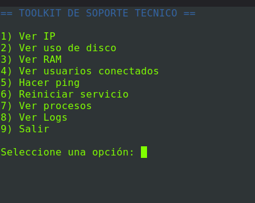
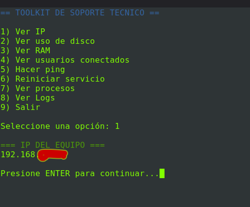
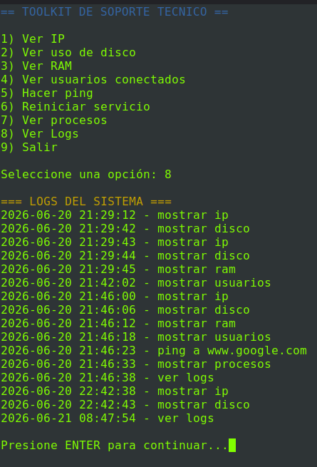

### Support Toolkit

### Menú principal

Herramienta de soporte técnico desarrollada en Bash para Linux.

Este proyecto fue creado con el objetivo de practicar scripting en Bash, administración básica de sistemas Linux y automatización de tareas frecuentes de soporte técnico.

Funcionalidades
Ver dirección IP del equipo
Ver uso de disco
Ver memoria RAM
Ver usuarios conectados
Realizar pruebas de conectividad con ping
Reiniciar servicios mediante systemctl
Ver procesos del sistema
Registrar acciones en un archivo de logs
Interfaz interactiva basada en menú

Proyecto realizado como práctica de Bash y soporte técnico Linux.

### Prueba de id

### Visualización de logs

